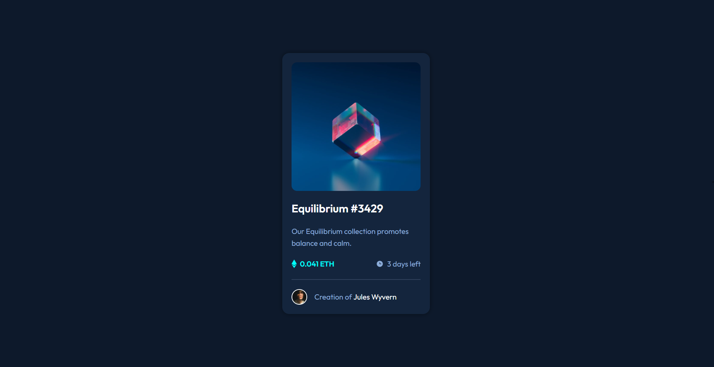
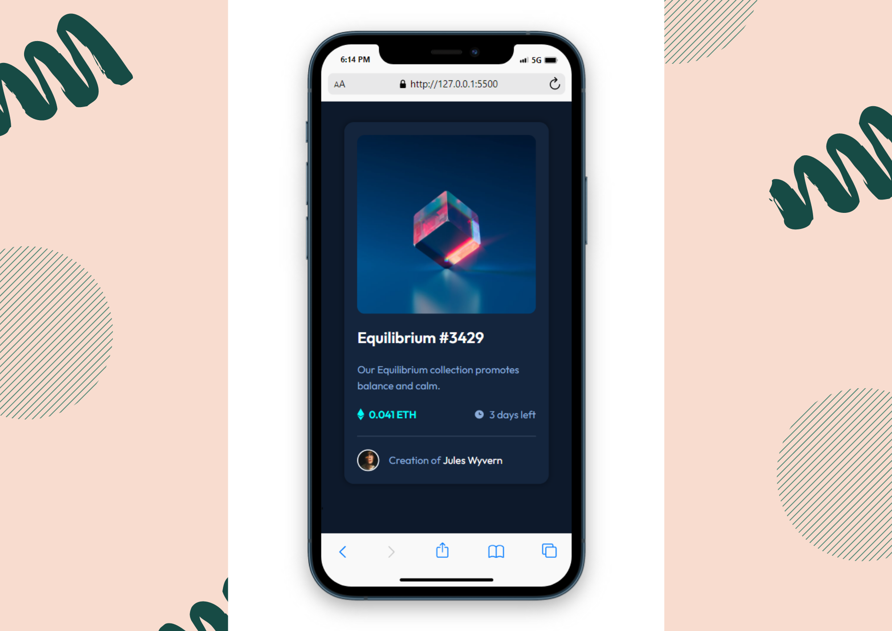

# Frontend Mentor - NFT preview card component solution

[NFT preview card component challenge on Frontend Mentor](https://www.frontendmentor.io/challenges/nft-preview-card-component-SbdUL_w0U)

## Table of contents

- [Overview](#overview)
  - [The challenge](#the-challenge)
  - [Screenshot](#screenshot)
  - [Links](#links)
- [My process](#my-process)
  - [Built with](#built-with)
  - [Useful resources](#useful-resources)
- [Author](#author)

## Overview

This is a solution to the [NFT preview card component challenge on Frontend Mentor](https://www.frontendmentor.io/challenges/nft-preview-card-component-SbdUL_w0U).

### The challenge

Users should be able to:

- View the optimal layout depending on their device's screen size
- See hover states for interactive elements

### Screenshot

#### Desktop Preview

#### Mobile Review

### Links

- Solution URL: [Solution](https://github.com/Himanshupegu/NFT-preview-card-component)
- Live Site URL: [Live Site](https://himanshupegu.github.io/NFT-preview-card-component/)

## My process

### Built with

- Semantic HTML5 markup
- CSS custom properties
- Flexbox
- Mobile-first workflow

### Useful resources

- [Cssmatic.com](https://www.cssmatic.com/box-shadow) - This helped me creating the shadows of the card.

## Author

- Frontend Mentor - [@Himanshupegu](https://www.frontendmentor.io/profile/Himanshupegu)
